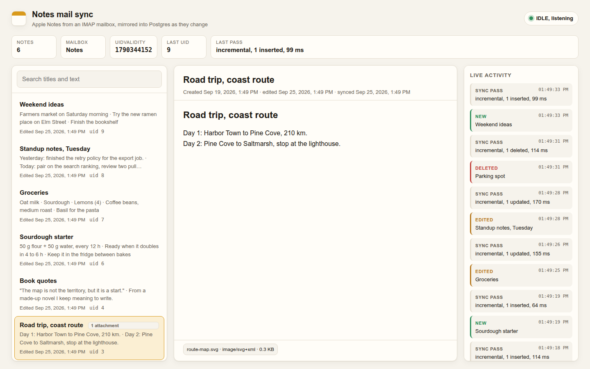
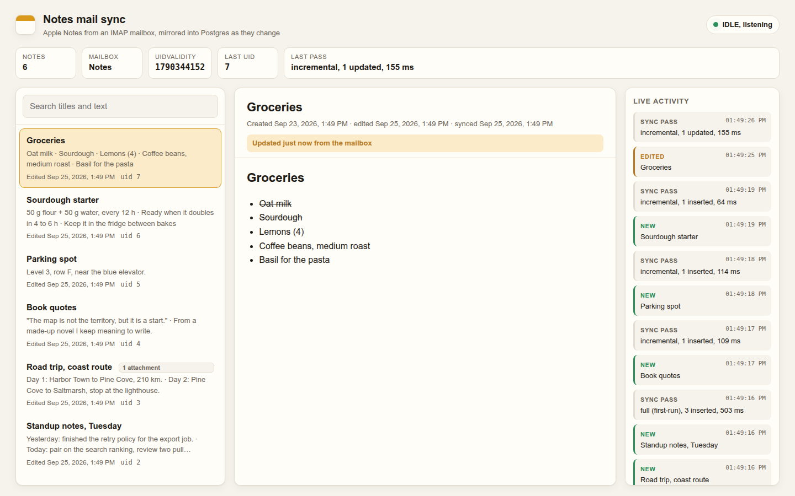
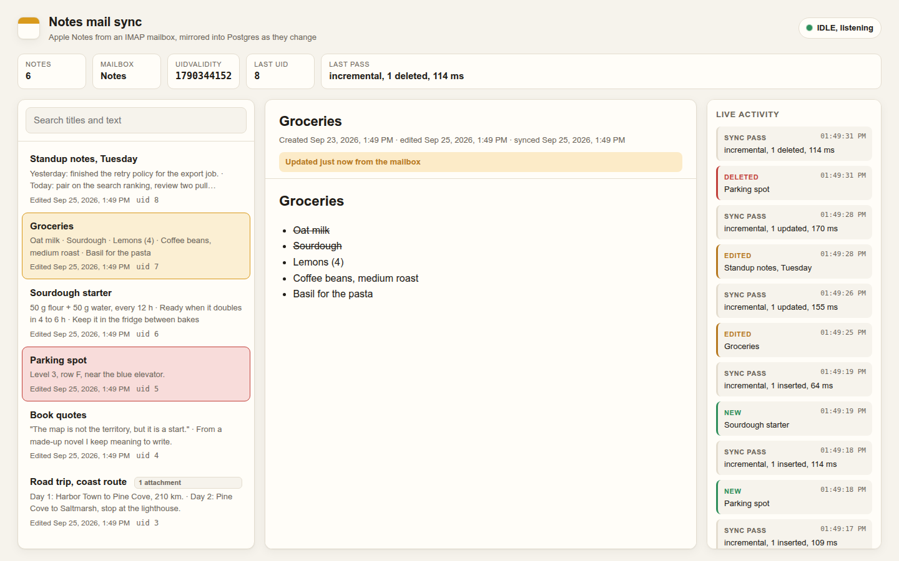
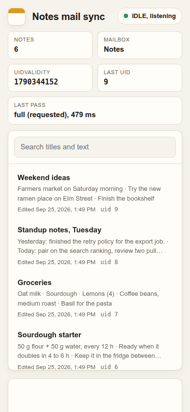

# phone-notes-sync

**Copies the notes you write on your phone into a database within seconds.**

*In plain words:* Notes written on a phone usually stay locked inside the notes app. This small service watches those notes, from Apple Notes on an iPhone, and copies each one into a database within seconds of it being written, changed or deleted. Once the notes are in a database, other programs can search them, list them or build on them. It comes with a simple web page that shows the notes and a live feed of every change.

A small service that keeps a Postgres table in sync with the notes I write on my
phone, live. Apple Notes can store notes in a mail account, where each note is
an ordinary message in a `Notes` IMAP folder. This service sits on that folder
with IMAP IDLE, and within a second of a note being added, edited or deleted,
the row in Postgres follows.



```bash
docker compose up --build        # then open http://localhost:8080
```

## Why I built it

I write most things on my phone: shopping lists, meeting notes, ideas I want to
come back to. Apple Notes is great for writing and terrible for everything
after that. There is no API, search only works inside the app, and the only way
to get notes into another tool is to export them by hand, one at a time, which
means it never happens.

It turns out there is a side door. When Notes is attached to a mail account
instead of iCloud Drive, every note is stored as a message on the IMAP server.
Messages are something any program can read. So instead of exporting, I wanted
a process that watches that folder and mirrors it into a database, where the
notes become searchable, queryable with SQL, and usable by whatever else I
build, without me doing anything after I hit save on the phone.

The first version was a quick script that polled every few minutes and compared
everything. It worked until it did not: edits showed up as a deleted note plus
a new one, a server-side mailbox rebuild wiped the table, and a long sync pass
meant changes made during it were only noticed at the next poll. This
repository is the rewrite that fixes those properly.

## What it does

- **Listens with IMAP IDLE** on one connection and fetches on another, so it
  never stops listening while it works. Reconnects forever with capped,
  jittered exponential backoff.
- **Incremental sync by UID.** Only messages above the last UID it processed are
  downloaded. Messages are immutable on IMAP, so a UID seen once never needs
  downloading again.
- **Handles UIDVALIDITY changes.** If the server renumbers the mailbox, stored
  UIDs are forgotten and a full pass re-links every note by identity. Nothing
  is deleted and re-created, and readers see no change at all.
- **Full resync pass** on every (re)connect and on a timer, as a safety net for
  anything missed while offline.
- **Parses the Apple Notes MIME format**: HTML body (quoted-printable, base64,
  multipart), title, created and modified dates, and attachment metadata.
- **Idempotent upsert keyed by the note's identity**, not by UID. Replaying a
  message is a no-op, and an older version can never overwrite a newer one,
  whatever order they arrive in.
- **Detects deletes**, and tells them apart from edits (which look like a delete
  plus an add on the wire).
- **Bounded work queue**: parsing and database writes run a few at a time, with
  retries for transient errors and backpressure on the fetch loop.
- **A read-only web page** that lists the notes and updates live over
  server-sent events, fed by Postgres `LISTEN/NOTIFY`, with full-text search.

The service is strictly read-only towards the mailbox. It opens the folder
with `EXAMINE`, so it cannot even mark a note as read.

## The demo

```bash
docker compose up --build
# or: npm run demo
```

This starts four containers: Postgres, [GreenMail](https://greenmail-mail-test.github.io/greenmail/)
(an in-memory IMAP server built for tests, with IDLE and UIDPLUS), the sync
service, and a seeder that plays the part of the phone. Open
<http://localhost:8080> and watch:

1. six invented notes arrive one by one,
2. two of them get edited the way the Notes app does it (a new message with the
   same identity is appended, then the old one is expunged),
3. one is deleted,
4. one more arrives.

Each step shows up on the page as it happens. Open a note before it is edited
and you will see the body change under you:

| An edit arriving | A delete arriving |
|---|---|
|  |  |

Things worth trying while it runs:

```bash
docker compose run --rm seed            # play the whole scenario again
docker compose restart imap             # kill the server under the listener
docker compose logs -f app              # watch it back off, reconnect and resync
```

Restarting GreenMail is a nice test: it keeps mail in memory, so it comes back
empty with a new UIDVALIDITY. Run the seeder again and the log shows
`reason=uidvalidity-changed`, the table keeps its rows, and the page does not
flicker.

`scripts/smoke.sh` runs the whole demo headless and asserts the end state,
including that edits and deletes were driven by IDLE events and not by the
periodic resync. CI runs it on every push.

<p align="center"></p>

## How it works

```
  phone ──▶ IMAP "Notes" folder
                │              │
     IDLE conn  │              │  fetch conn (EXAMINE, UID FETCH)
                ▼              ▼
          IdleListener ──▶ SyncScheduler ──▶ MailboxSync ──▶ WorkQueue ──▶ Postgres
          EXISTS/EXPUNGE   coalesces events    plans from UIDs   parse+upsert    │
                                                                                 │ NOTIFY
                                                    web page ◀── SSE ◀── LISTEN ◀┘
```

### What a note looks like on the server

```
Subject: Groceries
Date: Fri, 25 Sep 2026 13:38:57 GMT                   <- last modified
X-Mail-Created-Date: Wed, 23 Sep 2026 13:38:44 GMT
X-Uniform-Type-Identifier: com.apple.mail-note
X-Universally-Unique-Identifier: 6F1C2A3B-0D4E-4F51-9A62-7B8C9D0E1F21
Content-Type: text/html; charset=utf-8
Content-Transfer-Encoding: quoted-printable

<div><h1>Groceries</h1></div><ul><li>Oat milk</li>...
```

The important header is `X-Universally-Unique-Identifier`. When you edit a note,
the app does not change the message (IMAP messages cannot change). It appends
a new message with the same identifier and expunges the old one. So the UID of
a note changes on every edit, and the UID can never be the key. The table is
keyed by the identifier; the UID is only a pointer to where the current
version lives. Notes with pictures arrive as `multipart/mixed`, the HTML
referencing each attachment by `cid:`; the service keeps the attachment
metadata (name, type, size, content id) and leaves the bytes on the server.

### IDLE, and why there are two connections

`IDLE` (RFC 2177) lets the server push `EXISTS` (something arrived) and
`EXPUNGE` (something left) to a client instead of the client polling. The
catch is that a connection only receives these while it is idling, and it
cannot idle while it runs a `FETCH`. With one connection, a note saved during a
long sync pass would sit unnoticed until the next event. So the listener has
its own connection that does nothing but idle, and a second connection does the
fetching. The listener re-issues IDLE every 25 minutes, because servers are
allowed to drop an idle client after 30.

Events are not handled one by one. An edit produces an `EXISTS` and an
`EXPUNGE` a few milliseconds apart, and a seeder or a sync from another device
can produce dozens. The scheduler coalesces them: while a pass is running,
new triggers are merged, and exactly one follow-up pass handles all of them. A
pass that fails keeps its triggers and is retried with backoff, so a database
restart delays the sync rather than losing it.

If the listener connection drops, it reconnects with exponential backoff
(half fixed, half random, capped), and the first thing it does after
reconnecting is ask for a full pass, since anything could have happened while
it was away.

### UID bookkeeping

The rules IMAP guarantees, and everything here leans on:

- UIDs only go up, and are never reused while `UIDVALIDITY` stays the same.
- A message never changes. An edit is a new message.

So the state per mailbox is two numbers: `UIDVALIDITY`, and the highest UID
fully processed (the watermark). The planner (`src/uid-state.ts`, pure and
unit-tested) turns that state, the server's state and the triggers into one of:

| plan | when | what it does |
|---|---|---|
| `incremental` | EXISTS and/or EXPUNGE | `UID FETCH watermark+1:*`, and on EXPUNGE compare UIDs to find deletes |
| `full` | first run, reconnect, timer | compare every server UID with the table: fetch the unknown ones, delete notes whose UID is gone |
| `full` + reset | UIDVALIDITY changed | forget every stored UID first, then the same full pass |
| `full` + reset | UIDNEXT at or below the watermark | same as above: the mailbox was recreated and the server kept UIDVALIDITY |
| `noop` | EXISTS but UIDNEXT shows nothing new | nothing |

Two details that bit the first version:

- `UID FETCH 42:*` always returns at least one message, because `*` means "the
  highest UID", even when that is below 42. Those are filtered out instead of
  being treated as new.
- The watermark only moves past UIDs that are done. If message 45 fails with a
  database error while 44 and 47 succeed, the watermark stops at 44, and 45 is
  picked up on the next pass instead of being skipped forever. A message that
  is simply not a note (someone dragged an email into the folder) counts as
  done and is remembered, so full passes do not download it again.

### When UIDVALIDITY changes

A server changes `UIDVALIDITY` when it can no longer promise that old UIDs mean
what they meant: the mailbox was deleted and recreated, restored from backup,
or its index was rebuilt. Every stored UID is now garbage, and some of them
point at different messages.

The naive reaction is to wipe the table and download everything, which on the
page looks like every note being deleted and re-created. Because the table is
keyed by the note's identity and not by UID, the service can do better: it
nulls out the UID pointers, runs a full pass that re-links each note to its new
UID, and only deletes notes that really are gone. The notify trigger ignores
updates where the content hash did not change, so readers see nothing, because
nothing happened to the notes.

Servers do not always keep their side of the deal. While writing the
integration test I found that GreenMail derives `UIDVALIDITY` from the clock
in whole seconds, so a mailbox deleted and recreated within the same second
keeps the old value while its UIDs start again from 1. Every new message would
then sit below the watermark and never be fetched. The planner catches this
through `UIDNEXT`: it can never go down and is always above every existing UID,
so seeing it at or below a UID already processed can only mean the mailbox was
rebuilt, and the service handles it exactly like a `UIDVALIDITY` change. (If
enough messages arrive in the new mailbox to push `UIDNEXT` back above the
watermark before the service looks, there is no signal left to notice; that
one is on the server.)

### Writing to Postgres

One `INSERT ... ON CONFLICT (id) DO UPDATE ... WHERE ...` does all the deciding:

- if the stored row already has this content, UID and UIDVALIDITY, nothing is
  written and no notification fires;
- a version with an older `Date` never overwrites a newer one;
- on the same `Date`, the higher UID wins.

Because the decision is inside one statement, two writers racing on the same
note are serialized by the row lock, not by timing. This matters during an
edit, when the old and new messages can both be on the server for a moment and
get processed concurrently. Deletes run only after the queue has drained, so a
note that is mid-edit is never deleted and re-inserted.

Parsing and writing go through a small queue with bounded concurrency (4 by
default). Transient errors are retried with backoff; a `PermanentError` (a
message that is not a note) is not, because the answer will not change. The
fetch loop waits when the backlog is full, so a first sync of a large folder
does not load the whole mailbox into memory.

A trigger on the table sends `pg_notify('notes_changed', ...)` on every real
change. The web server listens on a dedicated connection and forwards changes
to the browser over server-sent events. Since the feed comes from Postgres and
not from the sync code, a change made by anything else (a script, a manual fix
in `psql`) shows up live too.

### The page

Plain HTML, CSS and a bit of JavaScript, served by the same process. Note
bodies are rendered in a sandboxed `iframe` under a strict Content Security
Policy: no scripts, and no remote images, so a tracking pixel pasted into a
note cannot report every time the page is opened. Search uses a weighted
`tsvector` (title above body) with `websearch_to_tsquery`, so `"coast route"
-lighthouse` works as you would expect.

## Using it with a real account

Point it at any IMAP server that holds your notes. The environment variables:

| variable | default | |
|---|---|---|
| `IMAP_HOST` | required | |
| `IMAP_PORT` | `993` (or `143` if not secure) | |
| `IMAP_SECURE` | `true` | TLS from the start |
| `IMAP_USER`, `IMAP_PASSWORD` | required | use an app-specific password |
| `NOTES_MAILBOX` | `Notes` | |
| `DATABASE_URL` | required | any Postgres 13+ |
| `WEB_HOST`, `WEB_PORT` | `0.0.0.0`, `8080` | |
| `SYNC_CONCURRENCY` | `4` | parse and write in parallel |
| `SYNC_MAX_ATTEMPTS` | `4` | per message, for transient errors |
| `RESYNC_INTERVAL_MS` | `600000` | full pass on a timer; `0` turns it off |
| `IDLE_RESTART_MS` | `1500000` | re-issue IDLE before the server's 30 minutes |
| `RECONNECT_BASE_MS`, `RECONNECT_MAX_MS` | `1000`, `60000` | backoff for the listener |

```bash
npm ci && npm run build
IMAP_HOST=imap.example.com IMAP_USER=me@example.com IMAP_PASSWORD=... \
DATABASE_URL=postgres://localhost/notes npm start
```

The schema is created on boot (`src/schema.ts`, every statement idempotent).

## Tests

```bash
npm test                                   # unit: 50 tests, no services needed
docker compose up -d postgres imap
npm run test:integration                   # against real IMAP and Postgres
scripts/smoke.sh                           # the compose demo, end to end
```

The unit tests run the production SQL against a real Postgres compiled to
WebAssembly ([PGlite](https://pglite.dev)), in process. The upsert rules,
the notify trigger and the delete query are tested as SQL, not against a mock
that agrees with whatever I wrote. The sync engine is tested against an
in-memory mailbox with real IMAP semantics: ascending UIDs, `n:*` returning the
last message, and a rebuild that renumbers everything under a new
UIDVALIDITY.

What is covered:

- **MIME parsing**: quoted-printable and base64 bodies, encoded subjects,
  multipart notes with attachments, missing subject, plain-text notes, and
  messages that are not notes.
- **UID bookkeeping**: every planner branch, the `n:*` quirk, the watermark
  holding at a failed UID.
- **UIDVALIDITY reset**: notes survive with the same identity, UIDs are
  re-linked, no notifications fire, a note deleted during the reset is still
  removed, and a recreated mailbox that kept its old UIDVALIDITY is caught.
- **Idempotent upsert**: replays are no-ops, older versions lose in any order,
  eight concurrent versions of one note converge on the newest.
- **Integration**: adds, edits and deletes followed through IDLE against
  GreenMail with no timer involved, a mailbox recreated under a new
  UIDVALIDITY, and a replayed full pass writing nothing.

## Layout

```
src/
  main.ts          wiring, signals, graceful shutdown
  imap.ts          IdleListener (IDLE + reconnect) and ImapMailSource (fetching)
  sync.ts          MailboxSync (one pass) and SyncScheduler (coalescing, retry)
  uid-state.ts     the UID and UIDVALIDITY rules, pure
  note.ts          Apple Notes MIME parsing
  note-format.ts   writes notes in the same format (seeder and tests)
  store.ts         Postgres: upsert, deletes, state, queries
  schema.ts        tables, search index, notify trigger
  queue.ts         bounded work queue with retries and backpressure
  notify.ts        LISTEN connection for the live feed
  web.ts           the page, JSON API and SSE
public/            the page
scripts/           demo seeder and the smoke test
test/              unit and integration tests, MIME fixtures
```

## What it does not do

- It syncs one direction, mailbox to database. Writing back would mean
  generating messages the Notes app accepts as its own, and that deserves its
  own project.
- It watches one folder. Notes in subfolders live in separate IMAP mailboxes;
  supporting them means one listener per folder, which the design allows but
  the demo does not need.
- Attachments are kept as metadata. The bytes stay on the server, fetchable by
  UID and content id when needed.
- It does not use CONDSTORE or QRESYNC. They would make deletion detection
  cheaper on very large folders, but Notes folders are small and not every
  server supports them, so the portable `UID SEARCH ALL` comparison is used.

## License

MIT
